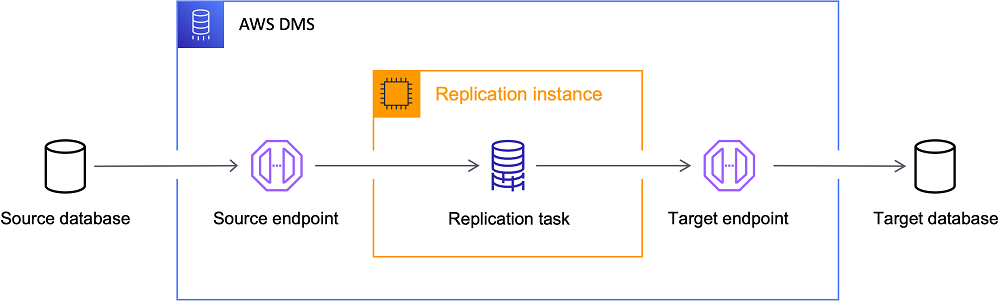
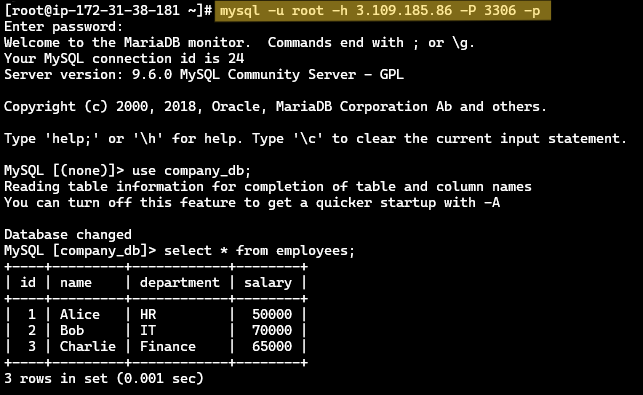
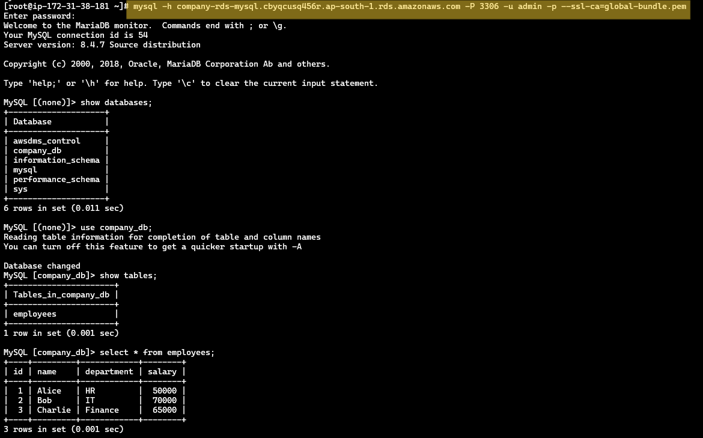
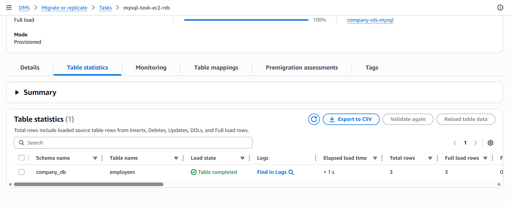
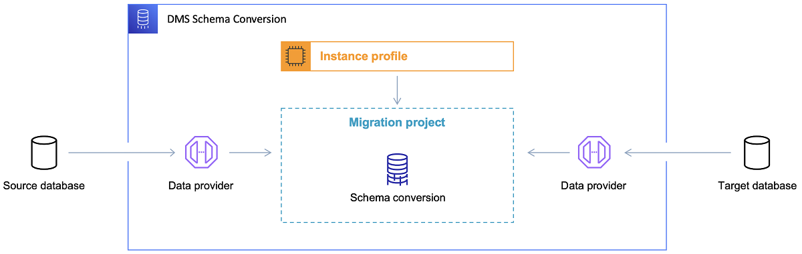

# AWS Database Migration Service (DMS)

# AWS Database Migration using AWS DMS

This project demonstrates **database migration** using **AWS Database Migration Service (DMS)**. The repository covers both **same-engine migration** and **cross-engine migration** scenarios.

The goal is to understand how data can be migrated from a source database to a target database using AWS managed services.

---

# What is AWS DMS?

AWS Database Migration Service (DMS) is a fully managed service that helps migrate databases to AWS quickly and securely.

It supports migrations between:

- Same database engines
- Different database engines
- On-premise to cloud
- Cloud to cloud

DMS can also perform **continuous data replication** using Change Data Capture (CDC).

---

# Why Do We Need Database Migration?

Organizations migrate databases for several reasons:

- Moving from on-premise infrastructure to cloud
- Upgrading database engines
- Reducing operational costs
- Improving scalability and availability
- Modernizing legacy applications

AWS DMS allows this migration with **minimal downtime**.

---

# AWS DMS Architecture



The migration workflow consists of several components:

Source Database → Source Endpoint → Replication Instance → Migration Task → Target Endpoint → Target Database

Main components:

- Source Endpoint
    - Connection configuration for the source database.
- Replication Instance
    - Compute instance managed by AWS DMS that performs the migration.
- Migration Task
    - Defines what data should be migrated and how.
- Target Endpoint
    - Connection configuration for the target database.
- Target Database
    - Destination database where data will be migrated.

---

# Migration Workflow

1. Configure source database

2. Configure target database

3. Create DMS replication instance

4. Create source endpoint

5. Create target endpoint

6. Define migration task

7. Run migration

8. Validate migrated data

---

# Types of Database Migration

## 1. Homogeneous Migration (Same DB Engine)

Example:

```
MySQL → MySQL

Oracle → Oracle

PostgreSQL → PostgreSQL
```

In this case:

- Schema remains compatible
- No schema conversion required
- AWS SCT is not required

Example used in this project:

EC2 MySQL → Amazon RDS MySQL

## 2. Heterogeneous Migration (Different DB Engine)

Example:

```
MySQL → PostgreSQL

Oracle → MySQL

SQL Server → PostgreSQL
```

In this case:

- Database schemas are different
- Data types may differ
- Schema conversion is required

This is where **AWS Schema Conversion Tool (SCT)** is used.

---

# Scenario 1: EC2 MySQL → Amazon RDS MySQL

This demonstrates **homogeneous migration**.

Steps:

1. Launch EC2 instance

2. Install MySQL on EC2

3. Create sample database

4. Create Amazon RDS MySQL instance

5. Configure AWS DMS replication instance

6. Create source endpoint (EC2 MySQL)

7. Create target endpoint (RDS MySQL)

8. Create migration task

9. Run migration

10. Validate data in RDS

---







---

# Scenario 2: MySQL → PostgreSQL

This demonstrates **heterogeneous migration**.

Steps:

1. Connect AWS SCT to MySQL

2. Connect AWS SCT to PostgreSQL

3. Convert database schema

4. Apply schema to PostgreSQL

5. Use AWS DMS to migrate data

## DMS Schema Conversion process Architecture



---

# Premigration Assessment

**Premigration Assessment** in AWS Database Migration Service is a **pre-check analysis** that runs **before the migration starts** to detect problems that might cause the migration to fail.

Think of it as a **health check for your database migration**.

It helps detect:

- compatibility issues
- missing permissions
- configuration problems
- unsupported data types

before the actual migration begins.

# What DMS Checks During Premigration Assessment

DMS performs several validations.

### Database Connectivity

It checks whether the replication instance can connect to:

- source database
- target database

Example checks:

```
Source endpoint reachable
Target endpoint reachable
```

### Schema Validation

DMS verifies that selected tables exist.

Example:

```
Validate that at least one selected object exists
```

This ensures the migration task actually has tables to migrate.

### Database Permissions

Checks if the DMS user has required privileges.

Example:

```
SELECT
INSERT
UPDATE
CREATE TABLE
DROP TABLE
```

Without these permissions migration may fail.

### Database Parameters

DMS checks database configuration parameters such as:

```
wait_timeout
net_read_timeout
net_write_timeout
```

If they are too low, the migration connection may drop.

```
# Run to increase timeout
mysql -u username -p
SET GLOBAL net_read_timeout = 600;
SET GLOBAL net_write_timeout = 600;
SET GLOBAL wait_timeout = 600;
```

### Table Structure

DMS validates whether tables have:

- primary keys
- indexes
- supported data types

This is important especially for **CDC (Change Data Capture)** migrations.

### Target Database Compatibility

Checks things like:

- foreign keys
- secondary indexes
- engine compatibility

to ensure data can be inserted correctly.

# Why Premigration Assessment Is Important

It helps avoid problems like:

- migration stopping midway
- connection timeouts
- missing tables
- permission errors
- incompatible schemas

Basically it **prevents migration failure**.

> 
> 
> 
> **Premigration assessment is optional.**
> 
> **You can disable it during task creation.**
>